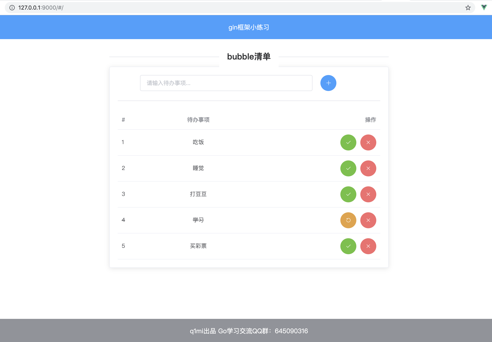

# tomatoList清单

一个基于gin+gorm开发的练手小项目，通过该项目可初识go web开发该有的姿势。

前端页面基于vue和ElementUI开发，对前端不熟悉的童鞋可直接下载`templates`和`static`文件夹下的内容使用。

## 使用指南
### 下载
```bash
git clone https://github.com/Q1mi/tomatoList.git
```
### 配置MySQL
1. 在你的数据库中执行以下命令，创建本项目所用的数据库：
```sql
CREATE DATABASE tomatoList DEFAULT CHARSET=utf8mb4;
```
2. 在`tomatoList/conf/config.ini`文件中按如下提示配置数据库连接信息。

```ini
port = 9090
release = false

[mysql]
user = 你的数据库用户名
password = 你的数据库密码
host = 你的数据库host地址
port = 你的数据库端口
db = tomatoList
```

### 编译
```bash
GOOS=linux GOARCH=amd64 go build -o outputFileName main.go 
```

### 执行

Mac/Unix：
```bash
./tomatoList conf/config.ini
```
Windows:
```bash
tomatoList.exe conf/config.ini
```

> ps.
>
> 我没有配置全局的环境变量，而是使用了goland自带的编译配置，同样配置了上面三个编译选项。但是当我点击debug按钮之后，发现linux下的可执行文件是生成了，但是ide并没有进入运行调试状态。
>
> 当时还一脸懵，现在想想不就是因为编译的是linux可执行文件，但又在windows上跑了吗？
>
> 真蠢呀。。

启动之后，使用浏览器打开`http://127.0.0.1:9000/`即可。



### docker运行

将本项目打包成docker运行一般分3步：

1. 设置dockerfile

   ```go
   /******old**************/
   FROM scratch
   ADD /tomatoList // go build生成的可执行文件 
   ADD /config.json // 根目录下的配置文件
   ENTRYPOINT ["/tomatoList"]
   
   /*******new************/
   FROM golang:1.19
   ENV env1=env1value
   ENV env2=env2value
   MAINTAINER blackfish
   # 仅指定镜像元数据内容
   LABEL tomatoList=1.0.0
   RUN git clone git@github.com:cauliflower-beep/tomatoList.git
   WORKDIR tomatoList
   RUN CGO_ENABLED=0 GOOS=linux GOARCH=amd64 go build -o tomatoList main.go
   EXPOSE 9090
   CMD ["./tomatoList","--param1=p1","--param2=p2"]
   # 执行 docker build -f Dockerfile 创建镜像
   # 或者执行 docker build -t tomatoList:1.0.0 .  使用当前目录作为上下文，构建一个名为tomatoList,标签为1.0.0的镜像。最后一个点表示使用当前目录作为上下文，可替换为其他目录路径
   # 上下文路径传 . docker在构建镜像的时候，会自动去当前目录下找 Dockerfile文件 来构建镜像
   # 上下文指docker引擎在构建镜像时使用的文件和目录的集合，上下文中的所有文件和目录都会被打包发送到docker引擎，然后在其中构建镜像
   # 如果镜像或容器已存在 先docker rm 容器id 再docker rmi 镜像 ，删除容器及镜像之后再构建新镜像
   ```

2. 打包成镜像

   ```go
   // 注意镜像名必须全小写，后面的上下文路径 . 不能忘
   docker build -t tomatolist:1.0.0 .
   // 执行完上述命令，如果遇到如下错误
   /*
   [+] Building 0.6s (3/3) FINISHED
    => [internal] load build definition from Dockerfile                                                                                                                                                                               0.0s 
    => => transferring dockerfile: 985B                                                                                                                                                                                               0.0s 
    => [internal] load .dockerignore                                                                                                                                                                                                  0.0s 
    => => transferring context: 2B                                                                                                                                                                                                    0.0s 
    => ERROR [internal] load metadata for docker.io/library/golang:1.19                                                                                                                                                               0.5s 
   ------
    > [internal] load metadata for docker.io/library/golang:1.19:
   ------
   failed to solve with frontend dockerfile.v0: failed to create LLB definition: unexpected status code [manifests 1.19]: 403 Forbidden
   */
   /* 表明Docker引擎在尝试从Docker Hub上下载Golang 1.19镜像的元数据时遇到了403 Forbidden错误。这可能是由于Docker Hub的限制导致的，因为Docker Hub对匿名用户的下载速度进行了限制。为了解决这个问题，你可以尝试使用一个已经下载了Golang 1.19镜像的本地镜像仓库来构建你的镜像。你可以使用以下命令将Golang 1.19镜像从Docker Hub下载到本地镜像仓库：
   docker pull golang:1.19
   这将从Docker Hub下载Golang 1.19镜像，并将其保存到本地镜像仓库中。然后可以继续执行上述构建镜像的命令
   */
   docker push tomatoList // 推送到远程镜像服务器
   ```

3. 运行docker镜像

   ```go
   docker run -p 9090:9090 tomatoList
   ```

   

